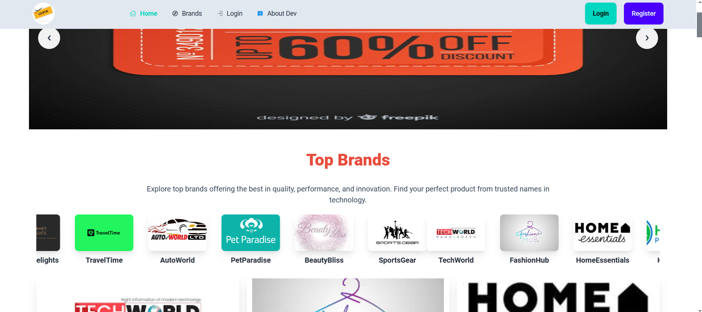

# Discount PRO: A Coupon Collecting Application

## Project Overview

Discount PRO is a simple and user-friendly coupon collecting application designed to help users easily find and use discount coupons for popular e-commerce shops in Bangladesh. The application collects various vouchers and coupon codes from multiple e-commerce stores, enabling users to save money conveniently. Users can log in using Firebase Authentication and explore available coupons with ease.

 <!-- Replace with an actual screenshot link -->

## Live Demo

[Live Application](https://copon2.netlify.app)

## Key Features

- **User Authentication**: Sign up or log in with email or Google account using Firebase Authentication.
- **Coupon Browsing**: View coupons by brand, with details like discount amount, expiry date, and categories.
- **Copy Coupon Codes**: Copy coupon codes with a single click using `react-copy-to-clipboard`.
- **Brand Pages**: Access detailed information about each brand, including available coupons.
- **Dynamic Home Page**: Includes sliders, top brands, and on-sale brands sections.
- **Responsiveness**: Fully responsive design for mobile, tablet, and desktop.
- **Profile Management**: View and update user information on the profile page.
- **Custom Error Page**: Display a 404 page for invalid routes with a navigation option to go back home.

## Technology Stack

- **Frontend**: React.js
- **Backend**: Firebase (Authentication, Hosting, and Database)
- **Styling**: Tailwind CSS
- **Animation**: AOS Package / Animate.css
- **Utilities**: React Fast Marquee, React Copy-to-Clipboard, React Toastify

## Dependencies

- `react`
- `firebase`
- `react-toastify`
- `react-copy-to-clipboard`
- `react-fast-marquee`
- `aos` / `animate.css`

## JSON Data Structure

### Sample Data

```json
[
  {
    "_id": "1",
    "brand_name": "Brand A",
    "rating": 4.5,
    "description": "High-quality products with amazing discounts.",
    "brand_logo": "https://example.com/brand-a-logo.png",
    "coupons": [
      {
        "coupon_code": "SAVE10",
        "description": "10% off on all products",
        "expiry_date": "2025-01-31",
        "condition": "Minimum purchase of $50",
        "coupon_type": "Percentage"
      }
    ],
    "shop_link": "https://brand-a.com",
    "category": "Electronics",
    "isSaleOn": true
  }
]
```

## Pages and Features

### 1. **Home Page** (`/`)

- **Banner Slider**: Displays promotional images.
- **Top Brands**: Marquee displaying brand logos with hover-to-pause functionality.
- **Brands on Sale**: Showcases brands with active sales in a card format.
- **Custom Sections**: Add two additional sections with static/dynamic content.

### 2. **Brands Page** (`/brands`)

- List all brands with search functionality.
- Each card includes brand logo, name, rating, and description.
- Highlights active sales with bouncing text.

### 3. **Authentication**

- Login and Registration with password validation.
- Google authentication.
- Password reset functionality.

### 4. **Brand Details Page** (`/brand/:id`)

- Display brand details and all coupons.
- Copy coupon codes with a button and show success toast.
- "Use Now" button redirects to the shop link.

### 5. **My Profile Page** (`/my-profile`)

- Displays user information with update functionality.

### 6. **Error Page**

- Custom 404 page with navigation back to Home.

## Environment Variables

Secure Firebase configuration keys using `.env` file. Example:

```env
REACT_APP_FIREBASE_API_KEY=your-api-key
REACT_APP_FIREBASE_AUTH_DOMAIN=your-auth-domain
REACT_APP_FIREBASE_PROJECT_ID=your-project-id
```

## How to Run Locally

1. Clone the repository:
   ```bash
   git clone https://github.com/tareqahmed2/copon-center
   ```
2. Navigate to the project directory:
   ```bash
   cd discount-pro
   ```
3. Install dependencies:
   ```bash
   npm install
   ```
4. Add your `.env` file with Firebase configuration.
5. Start the development server:
   ```bash
   npm start
   ```
6. Open [http://localhost:3000](http://localhost:3000) in your browser.

## Deployment

- Hosted on [Netlify/Firebase/Surge] (choose one).

## Challenges Implemented

- Password validation with custom rules.
- Forgot password functionality.
- Profile update features.
- Custom animations using `AOS`.
- Show/Hide password toggling.

## Author

- **Your Name**  
  [GitHub Profile](https://github.com/tareqahmed2)

---
